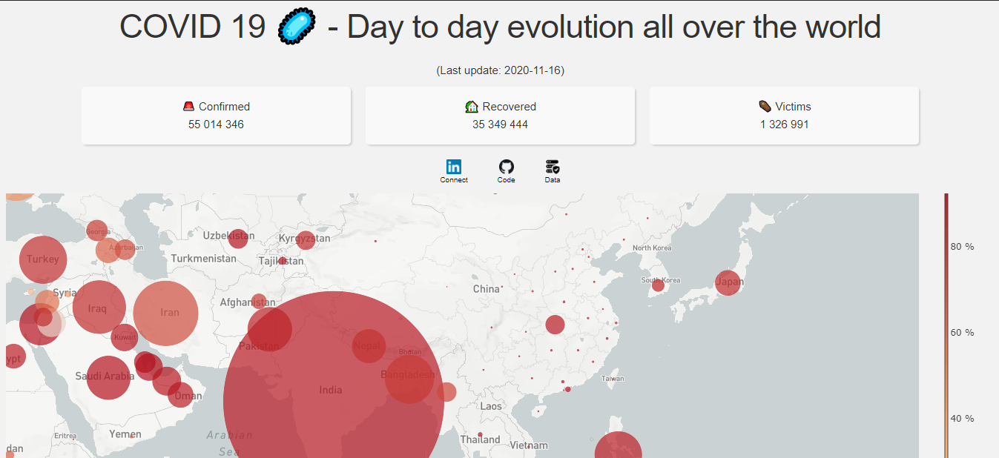

# Covid-19-worldwide-evolution
Dash 🚀 with animated scatter map on mapbox/plotly (COVID data) for tracking day to day evolution of COVID-19 through the world.
<h1 align="center">
   
  
   
</h1>

## Table of contents
* [General info](#general-info)
* [Screenshots](#screenshots)
* [Technologies](#technologies)
* [Features](#features)
* [Contact](#contact)

## General info
Add more general information about project. What the purpose of the project is? Motivation?

## Screenshots

## Technologies
*  - The [Plotly python library](https://plotly.com/) is an interactive, open-source plotting library that supports over 40 unique chart types covering a wide range of statistical, financial, geographic, scientific, and 3-dimensional use-cases.
*  - [Dash](https://dash.plotly.com/) is a productive Python framework for building web analytic applications. Written on top of Flask, Plotly.js, and React.js, Dash is ideal for building data visualization apps with highly custom user interfaces in pure Python. It's particularly suited for anyone who works with data in Python.
*  - [Mapbox](https://www.mapbox.com/) maps are [tile-based maps](https://en.wikipedia.org/wiki/Tiled_web_map).
*  - [Heroku](https://www.heroku.com/) is a cloud platform that lets companies build, deliver, monitor and scale apps — we're the fastest way to go from idea to URL, bypassing all those infrastructure headaches.

## Features
List of features ready and TODOs for future development
* Confirmed🚨 , Recovered🏡 And Death⚰️ counts of Covid-19 cases all over the wolrd.
* KPIs for a particular country available on hovering over that country.  
* Visualize spread and containment over all the world througout the year with 🎬 buttons and slider to go to a particular date 📅.   

## Contact
Created by [@Anurag Sharma](https://www.linkedin.com/in/anurag-sharma-0308/) - feel free to contact me!
